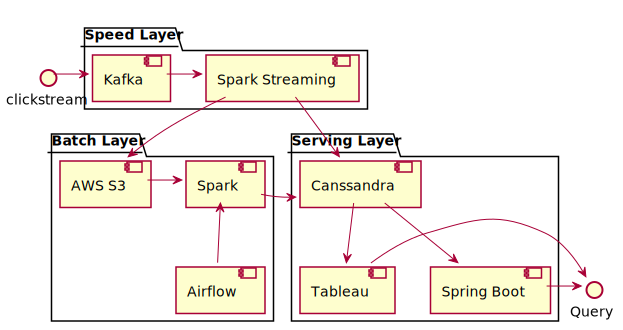

# Solution

## The lambda architecture

### Speed Layer

In this speed layer, we are processing the clickstream data using Kafka with Spark streaming and the two main tasks are performed in this layer: first, the streamed data is appended into AWS s3 for later batch processing; second, an streaming analysis is performed on real time data and save the result to Cassandra.

#### Kafka

The reason for choosing Kafka is a fast, scalable, distributed in nature by its design messaging system. The web/app backend server can easily send the click event data to Kafka using its API clients.

#### Spark Streaming

The reason for choosing Spark stream is the we can use Spark in both Speed Layer and Batch Layer. Spark provide similar high-level abstraction for streaming ant batch processing. Although other framework like Storm or Flink many more suitable also have their strengths in streaming processing, only using Sparking can simply the architecture and the cost of the DevOps.

### Batch Layer

In this layer, we are processing the batch data using Spark and storing the pre-computed views into Cassandra.

#### Airflow

The Spark batch processing job can be scheduled using Apache Airflow. Airflow define workflows as python code, which make them become more maintainable, versionable, testable, and collaborative. If the batch job goes more complicated, if more easy to use Airflow Dag to manage its dependencies.

### Serving Layer

Once the computed view from batch and speed layers are stored in the Cassandra database, we can use Tableau to create dashboards to visualize the data, or using a Spring Boot application which responds to ad-hoc queries.

#### Cassandra

Comparing with using a different database, Both Speed Layer and Batch Layer write the result directly to Cassandra, witch make the architecture simpler.

The reason choosing Cassandra is that it is a distributed, wide column store, NoSQL database management system designed to handle large amounts of data across many commodity servers, providing high availability with no single point of failure. The Cassandra Query Language (CQL) is a close relative of SQL which can reduce the learning curve for query the data.

#### Tableau

Tableau can connect to Cassandra query the data for visualization. Tableau is a powerful and fastest growing data visualization tool used in the Business Intelligence Industry. It helps in simplifying raw data into the very easily understandable format.

#### Spring Boot Application

Apart from using Tableau for visualization, we can develop our own application using Spring Boot to do data visualization or monitoring. Using Spring Boot can simply the development of a Java Application.

## Implement of Speed layer

The implement of speed layer is done in the clickstream_analysis/spark-processor project.
